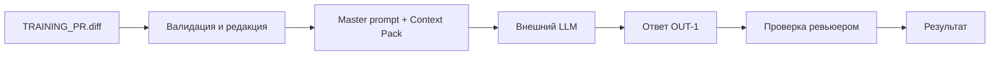

# ADR: решение для первого рабочего сценария

- Статус: proposed
- Дата: 2026-09-16
- Ответственные: студент‑инженер, преподаватель‑ревьюер

## Контекст

Сервис выполняет роль AI‑помощника ревьюера PR: принимает diff и возвращает summary, до 3 рисков и список проверок. Требуется соблюсти правила SEC‑1, API‑1, REL‑1, OUT‑1, SCOPE‑1, QA‑1, OBS‑1.

## Решение

Ввести слой предобработки diff: валидация и обрезка до 20 000 символов (API‑1), редакция секретов ([REDACTED]) по SEC‑1. Использовать master prompt с Context Pack, чтобы обеспечить структуру OUT‑1 и включение только подтверждённых рисков (QA‑1). LLM‑вызов ограничить таймаутом 10 секунд и конвертировать ошибки в контролируемый ответ (REL‑1). Логи ограничить request_id, длительностью и статусом (OBS‑1). Сервис сохраняет консультационный характер (SCOPE‑1).

## Рассмотренные альтернативы

| Альтернатива | Почему не выбрали сейчас |
|---|---|
| Полная автоматизация ревью с действиями в GitHub | Выходит за рамки SCOPE‑1; повышает риски |
| Отсутствие редакции секретов | Нарушает SEC‑1 и ведёт к утечкам |
| Свободный формат ответа | Непредсказуемость; сложность интеграции; нарушает OUT‑1 |

## Последствия и главный риск

- Положительные последствия:
  - Предсказуемая структура ответов; сниженный риск утечек; улучшенная проверяемость выводов
- Ограничения:
  - До 3 рисков; 20 000 символов на вход; 10 c таймаут — возможна потеря деталей
- Главный риск:
  - Недостаток контекста diff может скрыть важные риски; чрезмерная редакция секретов может маскировать evidence
- Как проверим риск:
  - Сквозные тесты с разнообразными диффами; проверка наличия [REDACTED] только для секретов; сравнение P1‑01 и P1‑02

## Архитектурная схема

## Как использовали AI

- Для чего: оформить архитектурное решение малого инкремента
- Тип промпта: ADR‑шаблон
- Строка в [`prompts.md`](prompts.md): P1-02
- Что проверили и исправили сами: согласование с правилами SEC‑1, API‑1, REL‑1, OUT‑1, OBS‑1
