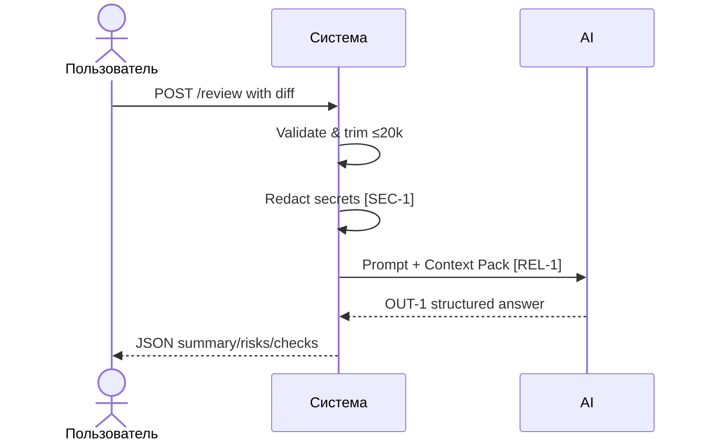

# Use cases и user stories

## Первый рабочий сценарий

**Когда** ревьюер отправляет строковый diff учебного PR сервису, **система** валидирует и обрезает вход до 20 000 символов, скрывает секреты, подготавливает prompt с Context Pack и вызывает внешний LLM с таймаутом 10 секунд, **а пользователь получает** структурированный результат формата OUT‑1: summary, не более трёх рисков с file/line/evidence/risk и список checks.

Не входит в этот сценарий:

- approve/merge/изменение кода; любые действия в GitHub; исправление кода агентом

## Use case

| Поле | Значение |
|---|---|
| Актор | Ревьюер PR |
| Триггер | Поступление строкового diff |
| Предусловия | Доступен REST‑сервис; валидный diff; доступ к внешнему LLM |
| Основной результат | Ответ в формате OUT‑1: summary, ≤3 risks с evidence, checks |
| Ошибка или отказ | 413 при diff > 20 000; контролируемый ответ при таймауте; 422 при невалидном входе |



## User stories и acceptance criteria

```gherkin
Feature: Review assistant returns OUT-1 structured findings

  Scenario: Позитивный — валидный короткий diff
    Given REST-сервис доступен и внешний LLM отвечает < 10 c
    And вход — строковый diff длиной ≤ 20 000 символов
    When я отправляю POST /review с diff
    Then получаю 200 и JSON с полями summary, risks (≤3), checks
    And каждый risk содержит file, line, evidence, risk

  Scenario: Негативный — длинный diff
    Given вход — строковый diff длиной > 20 000 символов
    When я отправляю POST /review с diff
    Then получаю 413 и текст об ограничении

  Scenario: Граничный — секреты в diff
    Given вход содержит маркёр «token=TEST123»
    When я отправляю POST /review с diff
    Then отправленный во внешний LLM prompt содержит [REDACTED] вместо токена
```

## Как использовали AI

- Для чего: сформулировать сценарии и acceptance на основе CASE.md
- Тип промпта: структурированное заполнение шаблона
- Строка в [`prompts.md`](prompts.md): P1-02
- Что проверили и исправили сами: согласовали сценарии с SEC‑1, API‑1, REL‑1, OUT‑1
