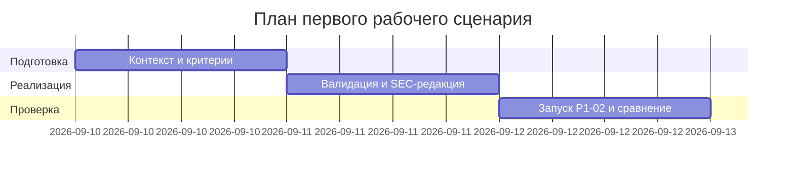

# План поставки

## Инкременты и ответственность

| Инкремент | Наблюдаемый результат | Что делает человек | Что делает AI или субагент | Проверка | Зависимости |
|---|---|---|---|---|---|
| 1 | Контекст и правила применены (Context Pack) | Собирает CASE.md, фиксирует правила и границы | Генерирует черновик master prompt | Ревью контекста и ограничений | CASE.md, README |
| 2 | Валидация входа и SEC‑редакция | Описывает правила валидации и SEC‑1 | Предлагает фильтры и формат OUT‑1 | Unit/интеграционные проверки | Инкремент 1 |
| 3 | Master prompt работает на TRAINING_PR.diff | Проводит запуск P1‑02 и сравнение | Выполняет structured prompting | Сравнение P1‑01 vs P1‑02 | Инкремент 2 |

## Диаграмма Ганта

Замените даты и задачи на свой план.

## Как использовали AI

- Для чего: структурировать инкременты и ответственность
- Тип промпта: планирование по шаблону
- Строка в [`prompts.md`](prompts.md): P1-02
- Что проверили и исправили сами: синхронизация зависимостей и проверок с контекстом
